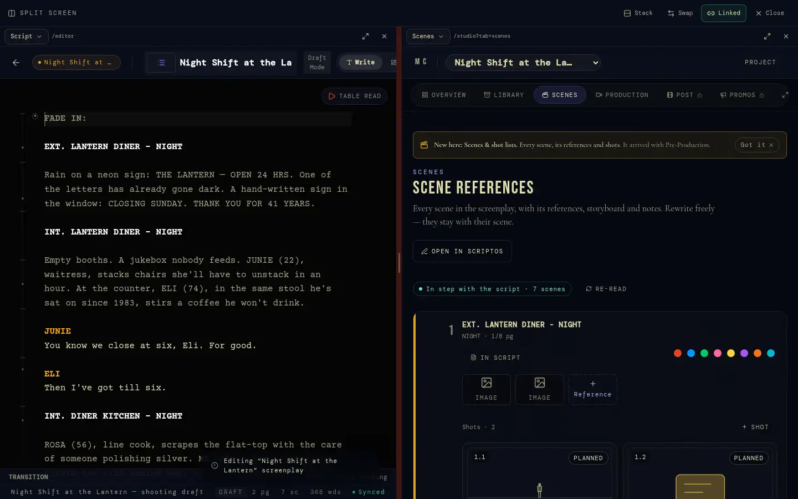
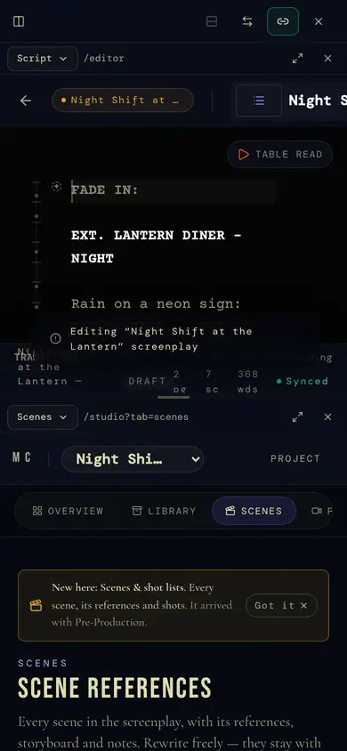

# 1 · Shell and navigation

The frame every signed-in page sits in: how people move between tools, find
things, get told things and change how the suite looks. Engineering detail:
[`routing-and-surface.md`](../routing-and-surface.md) §4.

## Purpose

One suite, not a row of apps. Wherever someone is, the same chrome tells them
where they are, what this page can do, and where they usually go next — and
it gets out of the way when they're writing.

## Screens

| | Desktop | Phone |
|---|---|---|
| Split screen |  |  |
| Island at rest (foot of any page) / tab bar |  |  |

## Parts

**Mounted once** (`app/layout.tsx` → `components/ClientShell.tsx`): providers
`Toast → Confirm → OS → Presence → Pill → Spotify`; then `CustomCursor`,
`CommandPalette`, `ShortcutsOverlay`, `ThemeInitializer`, the island
(`EcosystemTaskbar`, with `NotificationBell`), `MobileTabBar`,
`ServiceWorkerRegister`, `ErrorReporter`, and Pocket's `OutboxFlusher`,
`PlaceTracker`, `ContinueOffer`.

### The island (desktop and tablet)

One floating surface at the foot of the screen
(`components/EcosystemTaskbar.tsx`, `lib/island/*`). Its **mode** is a pure
function (`lib/island/mode.ts`, unit-tested) and is on `nav[data-island]`:

| State | When | Shows |
|---|---|---|
| `rest` | nothing happening | a pill: where you are + the page's lead number |
| `context` | pointer over a page zone that registered controls (`usePillZone`) | that zone's controls |
| `live` | something was `emit()`ted (saved, synced, someone joined) | the event, briefly |
| `open` | pointer/focus on it, a menu open, or pinned by a press | the suite strip (apps), the page's numbers and controls |
| `caps` | Caps Lock on | the open deck with a key on every control (1–6 apps, Q–I controls, `/` search, `\` split, `P` project, Esc) |
| `dot` | typing in a field | a dot — out of the way |

A page describes itself with `usePillStage(descriptor)` (title, fields,
toggles, actions); a page that doesn't still gets a name and next places from
`lib/island/routes.ts`. Size is per device (Settings › Island size). It
overlays the page; `--taskbar-height` is its resting footprint only.

### The phone tab bar (≤760px)

`components/mobile/MobileTabBar.tsx`: **Today · Projects · Capture · Lounge
(unread badge) · More**. More is a sheet: search, every tool, the active
project, and the page's island actions under "On this page". Hidden on the
editor, split, auth and public pages; slides away while a field has focus.

### ⌘K command palette

`components/CommandPalette.tsx`. Navigation and actions filtered as you type,
and `search_suite` results grouped by kind (project, script incl. its text,
scene, character, media, location, document, task, post note, job, person),
each opening where it lives. `?` opens the shortcuts overlay
(`ShortcutsOverlay.tsx`: global, island, editor, plot board).

### Split screen (`/split`)

Any two surfaces side by side in same-origin frames (`lib/split/*`,
`components/split/PaneShell.tsx`). Panes hide the suite chrome (`useInPane`)
and talk through the split page (`postToSplit` / `useSplitMessages`): the
script's caret scene drives the Studio pane; "In script" on a cut note jumps
the other pane. Open with Ctrl/⌘+\\, the island or ⌘K. Framing is
same-origin only (`frame-ancestors 'self'`).

### Notifications

`NotificationBell` in the island (and More on phones): unread count, newest
30, mark read / all read, delete; each has a site-relative `link` (call
sheets → `/call/[id]`, Lounge → `?channel=`/`?dm=`, jobs). Types are
switched off per account in Settings (`profiles.notification_prefs`:
replies, jobs, product, leak check). Who may notify whom: §10.

### Themes

`lib/themes.ts`: **Cavern** (house: vanilla on night ink, sinopia red),
Terminal, Blueprint, Mono, Paper, Editorial, Glass, Neon, Slate, Lagoon,
Forest, Vampire, System, or Custom (background + accent; contrast is computed
so text stays AA). Stored per account (`ui_prefs.theme`), applied before
paint by `ThemeInitializer`. `e2e/themes.spec.ts` checks contrast.

### Pocket (the suite in your pocket)

`components/mobile/Capture.tsx`, `Continue.tsx`, `lib/pocket/*`:
- **Capture** (tab bar centre, `/today?capture=1`, the home-screen shortcut,
  the phone share sheet via the manifest's `share_target`): a photo, clip,
  voice memo, note or link into a project's library. Kept on the device
  (IndexedDB outbox) until it's sent; `OutboxFlusher` sends when online.
- **Continue**: `PlaceTracker` saves the last resumable place per device kind
  (`ui_prefs.places`); the other device offers "pick up where you left off".

### The custom cursor

Adaptive cursor on mouse/trackpad (off on touch, off in Settings, off with
reduced motion).

## States

- **Signed out**: no island, no tab bar; landing shows `Navigation` instead.
- **Chrome-less routes**: editor (full-screen writing; island goes to `dot`
  while typing), split, auth, public share pages, legal pages.
- **In a split pane**: no chrome at all; the split page owns it.
- **Reduced motion**: every animation collapses (`MotionPreference`).

## Rules

- Feedback is `useToast()`, confirmation is `useConfirm()` — never native
  dialogs.
- Layers: island 9999 < tab bar 10000 < dialogs `--z-modal` 99990 < toast <
  confirm < cursor < palette 100000. A dialog inside a stacking context is
  portalled to `document.body`.
- A new page adds an entry to `lib/island/routes.ts` (or publishes
  `usePillStage`), so the island is never blank.

## Known gaps

- iPhone install works as a home-screen web app with the R13 icons (180 px
  touch icon, 192/512 and maskable manifest icons) but lacks splash screens,
  Add to Home Screen coaching and push (BACKLOG 3.13; iOS ignores
  `share_target` and manifest shortcuts).
