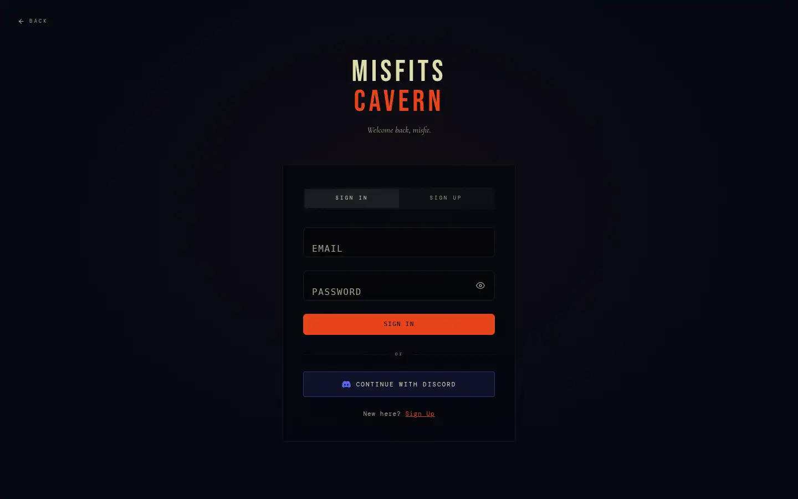
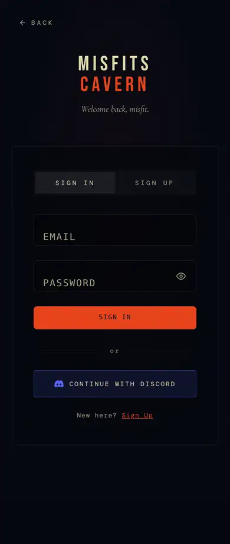
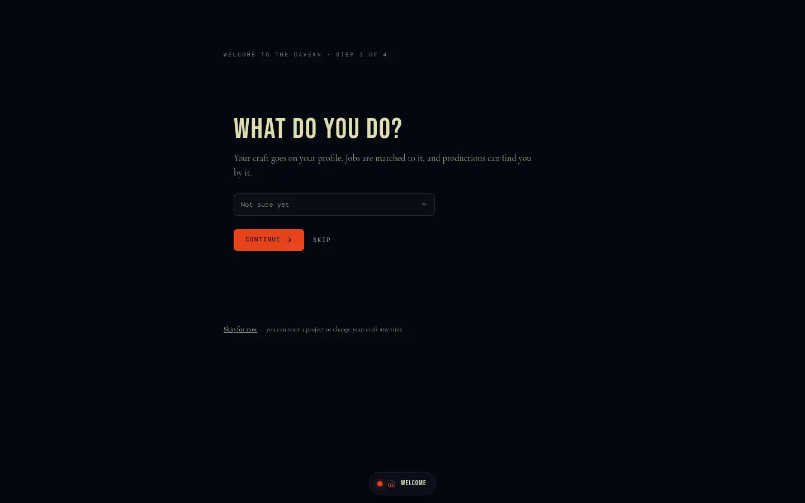
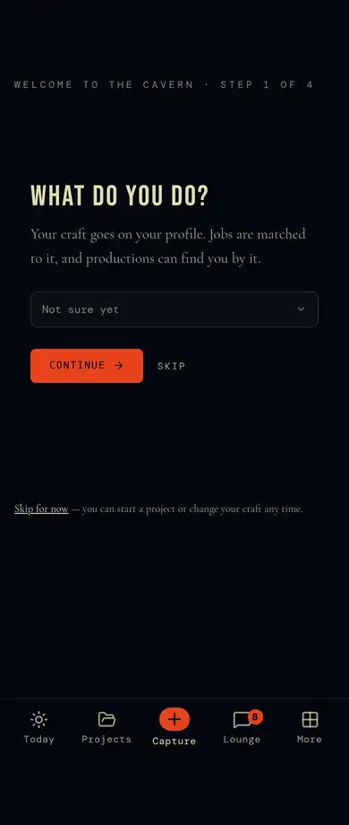
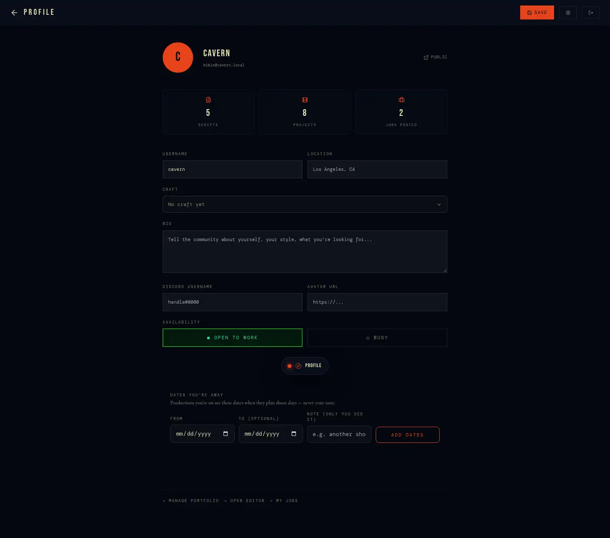
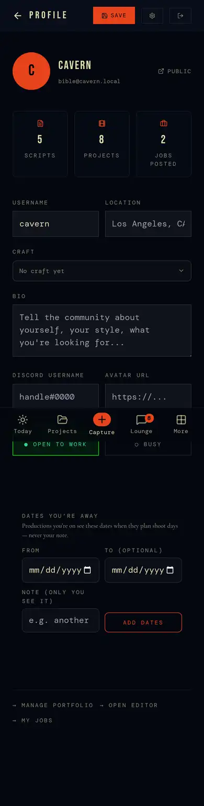
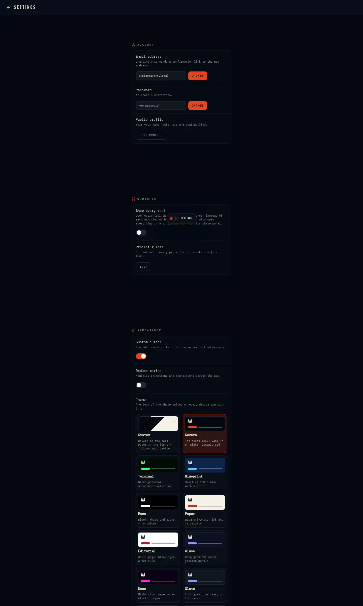
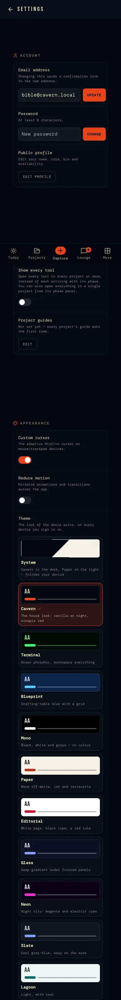

# 2 · Account: sign-in, welcome, profile, settings

How someone gets in, tells the suite who they are, and controls their
account. Data: `profiles` (column-restricted), `ui_prefs`, `notification_prefs`
— [`database-and-security.md`](../database-and-security.md) §1.

## Screens

| | Desktop | Phone |
|---|---|---|
| `/auth` |  |  |
| `/welcome` |  |  |
| `/profile` |  |  |
| `/settings` |  |  |

## `/auth` — sign in / sign up

- Two modes on one card ("Welcome back, misfit." / "Join the cavern."):
  email + password, or **Discord** (OAuth → `/auth/callback`). Sign-up takes
  a username, shows password strength (`lib/account/password-strength.ts`) and links
  the Terms and Privacy Policy.
- `?redirect=<path>` (set by `proxy.ts` for gated pages) is honoured if it's
  a site path (not `//…`, not `/auth…`); otherwise `/projects`. A **new
  account** with nowhere particular to go lands on `/welcome`.
- `/auth/callback` exchanges the OAuth code; a first sign-in goes to
  `/welcome`. `/auth/spotify-callback` finishes the Spotify connect (§6).
- States: idle · submitting · error (inline, validation from
  `lib/validation`) · signed in (redirects away) · `app/auth/error.tsx` for a
  crash.
- **No "forgot password"** — there is no recovery flow (no
  `resetPasswordForEmail`, no recovery landing). Someone who forgets a
  password is locked out. BACKLOG 3.4 (launch blocker).

## `/welcome` — first run

A new account's first stop. Every step optional, every answer changeable
later where it lives:
1. **Your craft** (`crafts`, `CraftPicker`) → `profiles.role`.
2. **How you work** — experience (first / some / seasoned), hours a week,
   team (solo / small / crew): sets how deep the project guides go
   (`ui_prefs.guide`, `lib/guides`).
3. **What you came for** — make something, find work, find people, show work.
4. If making: the project — title, format (`project_formats`), where it's at
   (sets its starting phase) and the format's first few brief questions.
5. Ends in a real place: the tool for the project's first step, the Jobs
   board, the Lounge or the portfolio (`lib/onboarding/onboarding.ts`).

## `/profile` — your own profile

Avatar, display name, username, bio, location, craft, links, availability
(`components/availability` → `unavailability`: dates away, private note;
planners see dates only via `project_availability`), credits (derived from
the work — §7), stats. "View public profile" opens `/crew/<you>`.

## `/settings`

| Section | Rows |
|---|---|
| Account | email address (change, confirmed by email), password (with strength), public profile link |
| Workspace | Show every tool (`ui_prefs.show_all_tools`), Project guides (depth / reset) |
| Appearance | theme picker (§1), custom cursor, island size (per device), motion |
| Notifications | comment replies, job & casting alerts, product updates, leaked-password detection |
| Data & Privacy | Export my data (profile, projects, scripts, jobs as JSON) |
| Sessions | sign out here · sign out everywhere |
| Delete account | `DeleteAccount.tsx` + `lib/account/deletion.ts`: hand each crewed project to a crew member (`transfer_project`), then `delete_my_account(username)` — solo projects go, shared work stays as "Deleted account" |

## Rules

- `profiles` is readable only through `PUBLIC_PROFILE_COLUMNS`; private
  fields come from `get_my_account()`; admin rights only via
  `set_user_admin()`.
- Account preferences live in the database (`ui_prefs`,
  `notification_prefs`, writing goal/sprint); device preferences (island
  size, cursor) in `localStorage`.
- Deleting is refused while the caller owns a crewed project or is the last
  admin.

## Connections

Craft → crew directory filters, job matching, Lounge audiences
(above/below the line). Guide profile → every project's guide. Theme → every
page. Availability → Studio's schedule and crew views.

## Known gaps

- No password recovery (above).
- Leaked-password protection is off in Supabase Auth (owner toggle).
- Only Discord for social sign-in; no Apple / Google (Apple sign-in becomes
  required if the iPhone app ships in the App Store with any third-party
  login — BACKLOG 3.13).
- e2e covers sign-up, sign-in, validation, onboarding and deletion; the OAuth
  callbacks have none (they need a provider).
