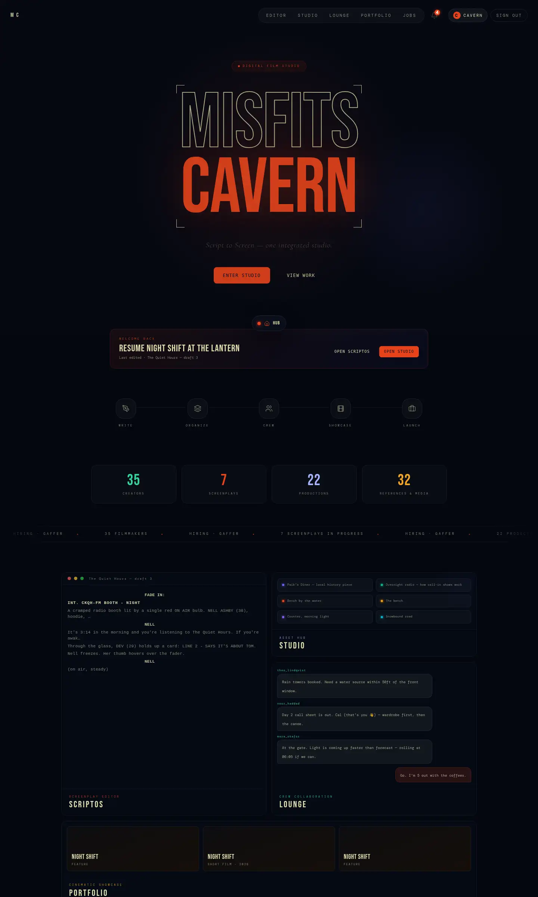
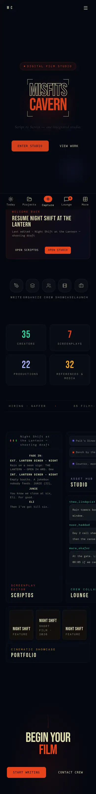
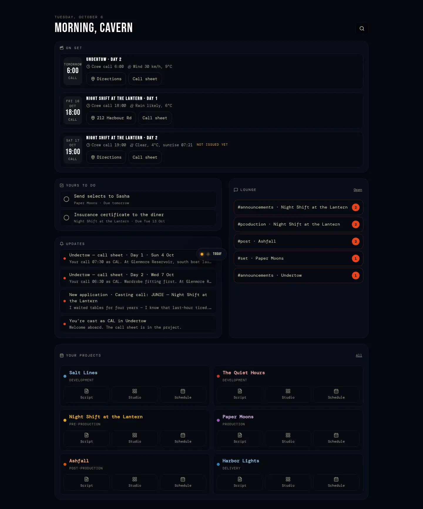
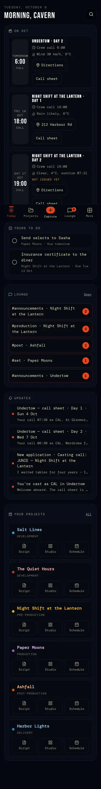
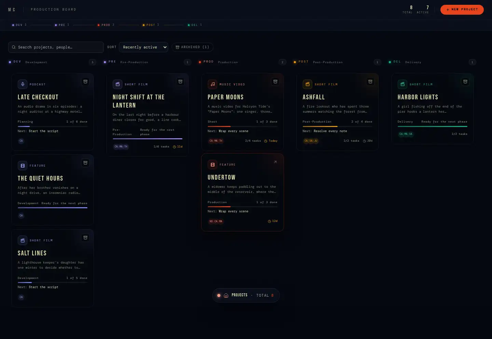
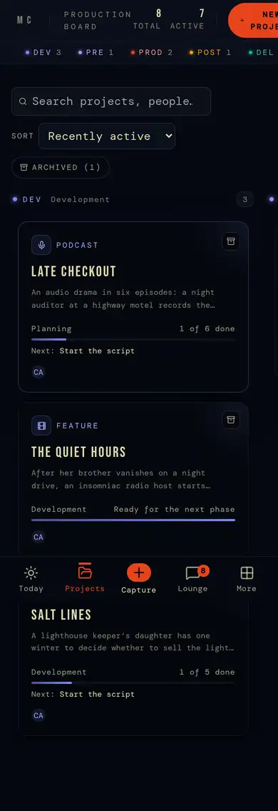
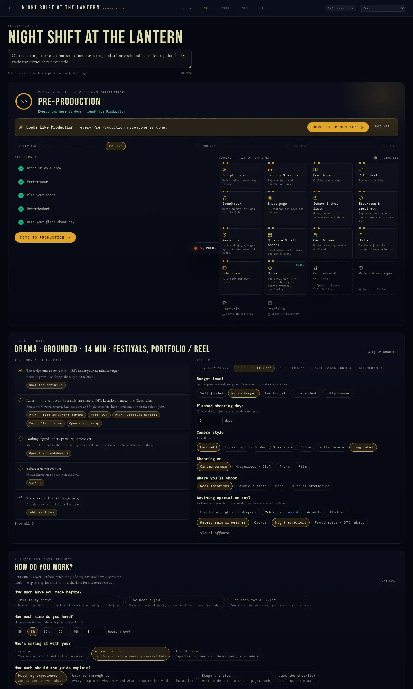
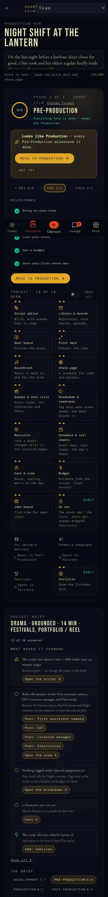
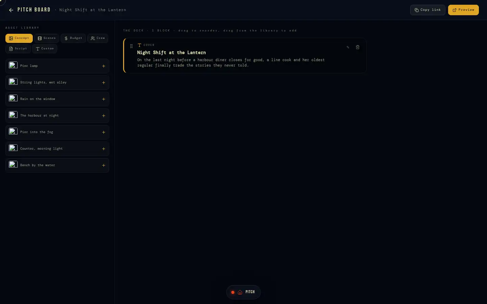
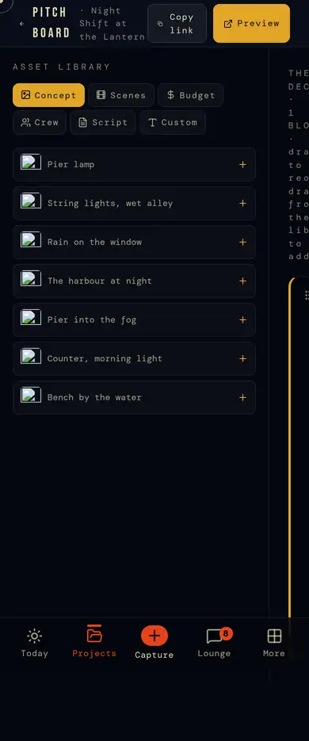

# 3 · Home, Today and projects

Where someone starts and where a production lives. The **project** is the
unit of everything: its phase decides which tools are open, its brief tells
each tool what this production needs, and its crew decides who sees it.
Deep docs: [`project-brief.md`](../project-brief.md), phases in §11.

## Screens

| | Desktop | Phone |
|---|---|---|
| `/` signed in (home) |  |  |
| `/today` |  |  |
| `/projects` |  |  |
| `/projects/[id]` |  |  |
| `/projects/[id]/pitch` |  |  |

## `/` — home (signed in)

The same page as the landing (§8) with the visitor's own layer on top: a
**Resume** card (the last script edited → open ScriptOS / open Studio), the
pipeline (Write · Organize · Crew · Showcase · Launch), platform totals
(`get_platform_stats`, samples excluded), a ticker of real activity (open
roles, screenplays in progress — `lib/home/ticker.ts`), and module tiles that
preview real content (the script, Studio references, Lounge messages,
portfolio pieces). Nav shows Editor · Studio · Lounge · Portfolio · Jobs, the
bell and the account.

## `/today` — the working home on a phone

`app/today`, `lib/today/core.ts` (unit-tested). The phone's first tab; fine on
a desk. Everything is read from what the suite already holds:
- **On set** — the next three shoot days the person is on: date, *their*
  call time, crew call, weather, address → maps, the call sheet. Crew see
  issued days; the owner also sees drafts ("not issued yet").
- **Yours to do** — tasks assigned to them, by urgency (overdue, today,
  soon), ticked off here.
- **Lounge** — unread by channel and DM, each a deep link.
- **Updates** — notifications (call sheets, applications, castings).
- **Your projects** — each with Script / Studio / Schedule jumps.
- **Continue** — the other device's last place (Pocket).
- `?capture=1` opens Capture; `?url=|text=|title=` (share sheet) prefills it.
- States: loading · empty (no projects: a start card) · offline (cached
  shell; captures queue).

## `/projects` — the board

Every project the person owns or is confirmed crew on, as cards: format icon,
phase colour, title, logline, the current phase's progress ("3 of 5 done" /
"Ready for the next phase", from `projects_progress`), end date countdown.
Search, sort (recently active, newest, title, nearest end date, furthest
along), show archived. **Start a project** (title, format, optional logline).
Archive / restore is the owner's (`projects.archived_at`; crew still see it).
Empty state: "Start your first".

## `/projects/[id]` — the project hub

One page per production (`app/projects/[id]/page.tsx`, 1256 lines):
- **Header**: title, format, the five-phase track, tasks done, visibility.
- **Logline** — edited in place; leads the pitch deck and share page.
- **Phase card**: phase *n* of 5 with its milestones (read from the data,
  never ticked — `lib/os/progress.ts`), the suggestion to move on when
  they're done ("Looks like Production — Move to Production / Not yet"),
  and the **toolkit**: every tool, open or "Opens in <phase>", with "Open
  all" (owner).
- **Project brief** (`BriefPanel`): the answers so far as a headline
  ("Drama · grounded · 14 min · festivals"), questions by phase, and **what
  moves it forward** (`nextMoves`): script vs target length, roles the
  project needs (one-click job posts), empty breakdown categories, uncast
  characters, what the script implies ("· script" chips).
- **Guide** (`GuidePanel`, `lib/guides`): "How do you work?" then a paced
  workflow for this project — steps by phase, depth by experience, weeks by
  hours and team.
- **Department windows**: script, assets, crew, timeline, portfolio previews.
- **Production manager** (`ProductionManager`): tasks (assignee, due),
  budget lines (estimate from the script, push breakdown, actuals from paid
  expenses), timeline milestones, crew (add by username with craft),
  festivals (planned / submitted / accepted / rejected), project settings.
- States: loading · not found / no access (Riley sees nothing) · viewer
  (read-only; brief and tasks need `can_shape_project`).

## `/projects/[id]/pitch` — pitch board

A drag-and-drop board of blocks pulled from the project (concept art, scenes,
budget, crew, script, custom text) → saved as the project's portfolio blocks
(`portfolio_projects` / blocks) and published as its press kit (§7, §8).

## Rules

- A project is visible to its creator and confirmed crew unless private
  (`internal.can_access_project`); everything project-scoped follows that.
- Owner: everything. Lead / contributor ("shapers", `can_shape_project`):
  brief, tasks, budget, call sheets, crew planning. Viewer: read.
- Phase moves are suggested, never forced; the owner moves the phase.

## Known gaps

- Festivals live in one jsonb column on `projects` (fine now; a table if
  they grow).
- The activity feed shows only some kinds of change (BACKLOG 3.5, product
  call).
