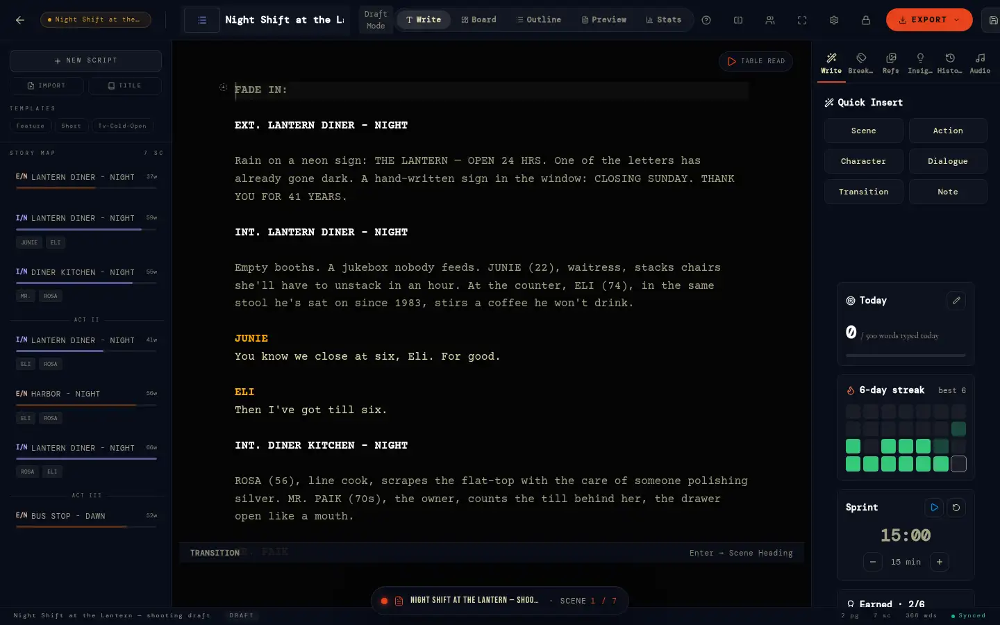
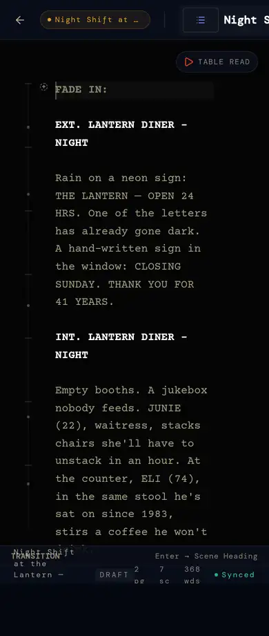

# 4 · ScriptOS — the script editor

`/editor` (`app/(suite)/editor/page.tsx`, 1611 lines, 123 files in its graph — the
largest surface). Where the story is written, and where most of the suite's
data starts: scene headings become scenes, tags become the breakdown,
characters become casting, margin notes become shots, beats and tasks.
Engineering detail: [`scriptos-engine.md`](../scriptos-engine.md).

## Screens

| | Desktop | Phone |
|---|---|---|
| `/editor?script=…` |  |  |

## Layout

- **Header** (`EditorHeader`): script title, sync state, collaborators'
  avatars, view switch **Write · Preview · Board · Outline · Stats**.
- **Left nav** (`EditorLeftNav`): the project's scripts, new / import (PDF,
  FDX, Fountain, text — `lib/scriptos/import.ts`, `pdfImport.ts`), title
  page, the scene list.
- **Centre** (`EditorCenterViews`, `WriteView`, `PreviewView`): the page.
  Write = screenplay-formatted typing (Fountain emphasis — `*italic*`,
  `**bold**`, `_underline_` — drawn styled with the markers dimmed,
  `lib/scriptos/emphasis.ts`; Tab cycles element, autocomplete for
  characters and headings, `(` auto-closes, Enter formats a heading);
  Preview = paginated; Board = scene cards; Outline = beats; Stats = length,
  runtime, characters, words.
- **Right panel** (`EditorSidePanels`): **Write** (writing loop: today vs
  goal, streak, sprints — `WritingLoop.tsx`, `lib/writing`), **Breakdown**
  (tag mode), **Refs** (the current scene's references, note and colour —
  `SceneReferencesPanel`), **Insights** (analysis, the brief's target
  length), **History** (revisions), **Audio** (soundtrack).
- **Footer** (`WriteFooter`): page / scene / word count, focus and
  typewriter modes.
- Margins: cut notes on their lines (`CutNoteMarkers`, live) and script
  annotations.

## Features

| Feature | How it works | Data |
|---|---|---|
| Formats | screenplay (Fountain), plus formats picked by the project's format (`formats-core`) | `scripts.format` |
| Scenes follow the script | headings → `scenes`, ids stable through rewrites (`planSceneSync`, `useEditorScenes`) | `scenes`, `sync_script_scenes` |
| Breakdown tagging | select text → category; suggestions from your other projects (`breakdown_memory`) | `breakdown_elements`, `scene_elements` |
| Characters | the character bible (description, backstory, motivation, arc, notes) | `script_metadata.character_bible`, `script_characters` |
| Margin notes | Shot / Beat / To-do notes create the shot, beat or task (`add_script_annotation`) | `script_annotations` |
| Revisions | lock a draft; later changes are coloured pages (`REVISION_COLORS`); diff view | `script_revisions` (`lib/scriptos/revisions.ts`) |
| Table read | the browser reads it aloud, a voice per character; scene times saved | `scenes.read_seconds` |
| Runtime | eighths of a page per scene (`timing.ts`), table-read time when known | `scenes.est_duration` |
| Stash | snippets beside the script | `script_stash` |
| Export | PDF (with title page), FDX, Fountain, text | — |
| Share | the header's **Share** (owner, or a project's shapers): link on/off, copy, new link (closes the old) → `/s/<token>` read-only (§8), read through `get_shared_script` | `scripts.shared`, `scripts.share_token` (guarded by `scripts_share_guard`) |
| Writing loop | words typed (not pasted) → `log_writing`; streaks, sprints, badges | `writing_days` |

## Co-writing and offline (how it really works)

- **Live**: one Realtime channel per script (`script_<id>`). Each writer's
  text is broadcast and saved to `scripts.content` 1.5 s after typing stops;
  others apply it. Presence shows who's in and where; carets are broadcast.
- **Conflict**: if a remote version arrives while you're typing and both
  sides changed more than a few characters from the last shared text, the
  editor stops and asks **KEEP MINE / TAKE THEIRS** (the banner at the foot
  of the page). Otherwise the newer text wins — it's whole-document,
  last-writer-wins, not a character merge.
- **Offline**: every save goes to IndexedDB first (`idb-keyval`,
  `script_<id>`, `syncPending`), then to Supabase if online. A failed save
  retries in 15 s (`scheduleScriptSync`) and on the `online` event
  (`syncPendingScripts`); deletes made offline are tombstones replayed on
  reconnect so a script never comes back. The current script pointer and
  editor modes live in `localStorage`.

## States

Loading · no script (create or import) · personal script (no project: no
scene index; notes kept on the device until it joins a project) · project
script · shared read-only · offline (saved on device, "will sync") ·
syncing / synced · conflict · error boundary (`EditorErrorBoundary`).

## Rules

- A project script belongs to the project (`can_access_project`); a
  personal one to its author (`can_access_script`).
- Scene script fields are written only by the sync; people own note,
  colour, shoot day, status.
- Viewers read; contributors and up write.

## Known gaps

- Co-writing is last-writer-wins with a conflict prompt; two people typing
  in different scenes at once can still trip it. A CRDT (Yjs) would merge —
  a large change, not yet scheduled.
