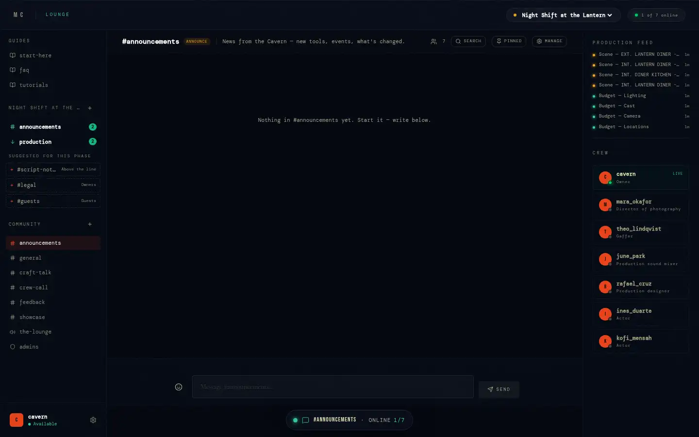
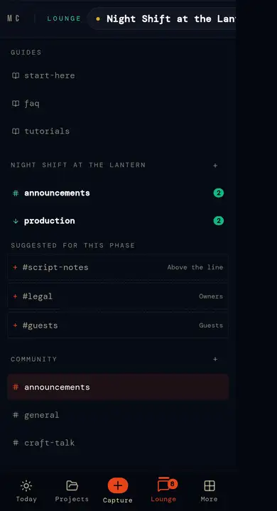
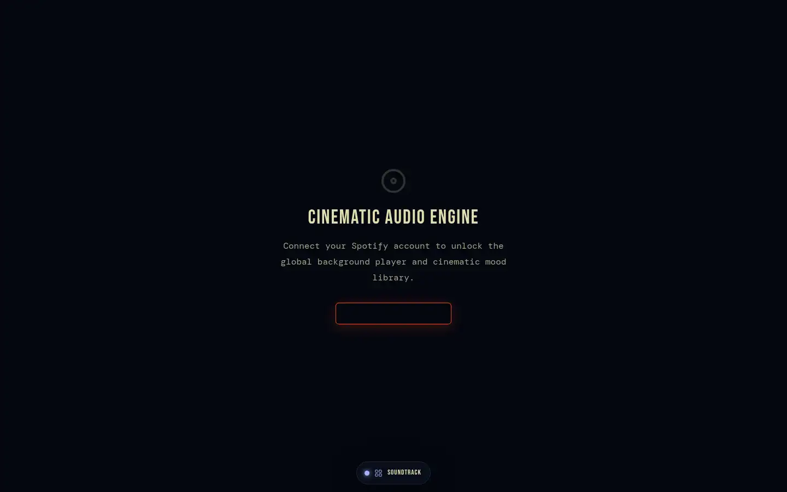
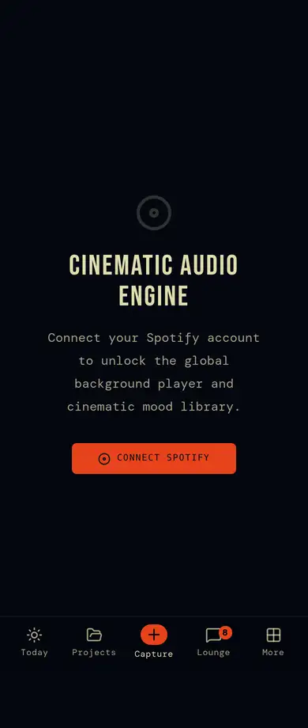

# 6 · The Lounge, voice and sound

Talking and listening. The Lounge is the crew's chat and voice — project
channels, community channels, DMs, guides. The Soundtrack is music to work to
and for the film. Engineering detail:
[`lounge-and-audio.md`](../lounge-and-audio.md).

## Screens

| | Desktop | Phone |
|---|---|---|
| `/lounge` |  |  |
| `/soundtrack` |  |  |

## `/lounge`

`app/lounge/page.tsx` (1531 lines), `components/lounge/LoungePanels.tsx`,
`lib/lounge/audience.ts`, `lib/webrtc/voice.ts`.

- **Left**: the active project's channels grouped by audience, community
  channels, DMs (crew list with presence and unread badges); suggested
  channels from the brief (`suggestChannels`, presets by phase).
- **Centre**: the conversation — messages, threads (`parent_message_id`),
  reactions (`toggle_message_reaction`), edit own (`edit_message`, "(edited)"),
  pin (`pin_message`), delete (sender or channel manager), typing presence.
  Guides (`type = 'guide'`) render as read-only sections.
- **Header**: topic, Pinned panel, search (`search_lounge`: word starts,
  newest 40, jumps to the message — switching project if needed), manage
  (audience, post policy, private roster, Discord webhook).
- **Voice**: a voice channel is a full-mesh WebRTC room (2–8 people);
  signalling over Realtime broadcast; the newcomer makes the offers. Speaking
  rings on avatars.
- **Unread**: `lounge_reads` + `lounge_unread()`; badges on channels, DMs, the
  tab bar and the island.
- Deep links: `?channel=<id>`, `?dm=<user>` (notifications use them).
- States: no project (community + DMs only) · empty channel · read-only
  (post policy / guide) · private (roster) · offline (send fails, toast) ·
  voice connecting / connected / failed.

### Who sees what

| Scope | Audience | Who |
|---|---|---|
| Community | `users` / `admins` | everyone signed in / admins |
| Project | `team` | owner + all crew |
| Project | `owners` | owner + leads |
| Project | `above` / `below` | owners + above / below-the-line crafts |
| Project | `guests` | owners + viewers |
| Project | `public` | anyone signed in reads |

Private narrows any of these to a roster. Project channels are created by
the owner or crew; community channels by admins.

### Discord bridge

A channel can post to a Discord webhook (`discord_integrations`, never
readable by browsers). `/api/discord/notify` (Bearer token; caller must see
the channel) reads the webhook with the service role and posts;
`/api/discord/test` checks it. Webhook URLs are re-validated before every
fetch.

## `/soundtrack`

`app/soundtrack/page.tsx`, `lib/spotify/*`, `GlobalAudioWidget`:
- **Moods from the script** (`lib/spotify/moods.ts`): each scene scored
  against what it describes (a chase, grief, a kiss…); scenes that share a
  mood are grouped ("Dread · scenes 3, 7, 12"), each a Spotify search.
- **Spotify**: connect (OAuth → `/auth/spotify-callback`, tokens in
  `spotify_connections`), search, play in the global widget (Web Playback).
- **Save to the project** (`project_audio_references`) — the project's audio
  bible.
- **SFX library**: upload sounds (≤ 20 MB) to the public `sfx_library`
  bucket (`sfx_assets`), play them back.
- States: not connected · connected (Premium needed for playback) · no active
  project.

## Rules

- `messages` has no UPDATE policy: edits, pins and reactions are definer RPCs
  that check the caller first.
- `search_lounge` runs as the caller (RLS decides what's found).
- Uploads to `sfx_library` only into `<your id>/…`.

## Known gaps

- Voice is mesh: beyond ~8 speakers it needs an SFU.
- Lounge DMs and messages aren't end-to-end encrypted (fine for a crew tool;
  say so in the privacy policy — it does).
