# 7 · The network: crew, jobs, portfolio, showcase

The people side of The Cavern — the part that makes it an ecosystem rather
than a private tool. Filmmakers find each other (crew directory), hire and
get hired (jobs, casting calls), and show the work (portfolio, credits,
showcase). Everything here is built from the work itself: credits come from
the projects people were actually on.

## Screens

| | Desktop | Phone |
|---|---|---|
| `/crew` | 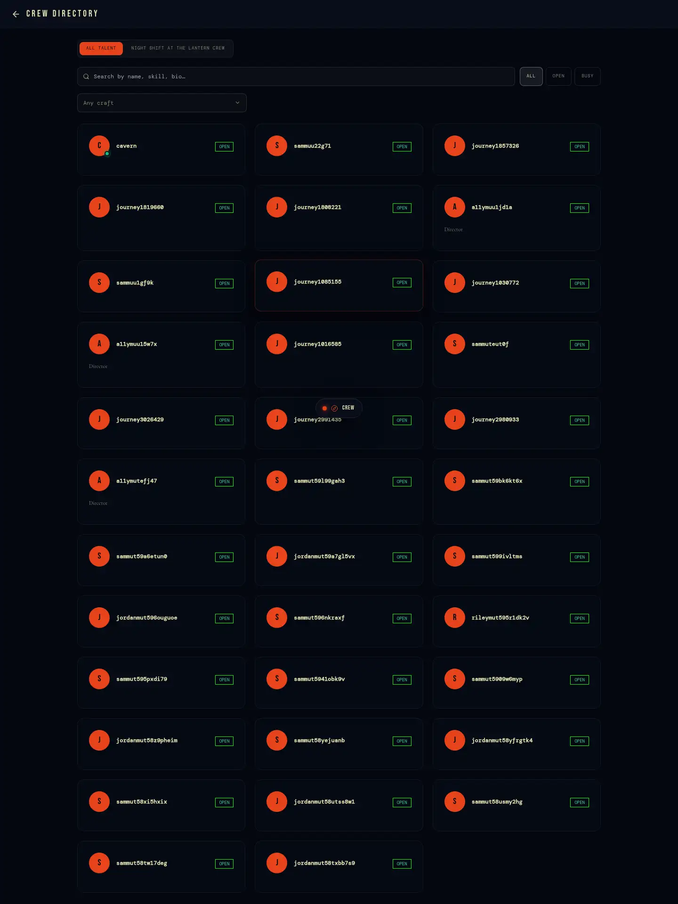 | 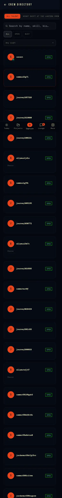 |
| `/crew/[id]` | 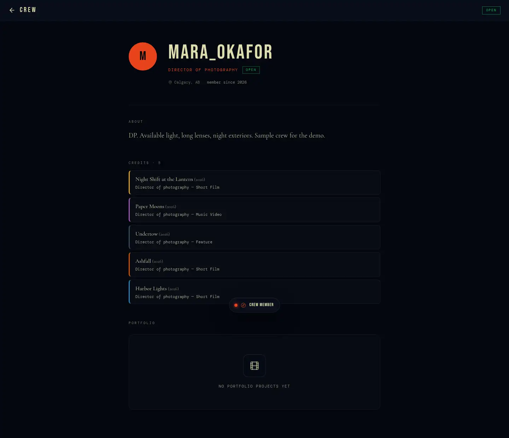 | 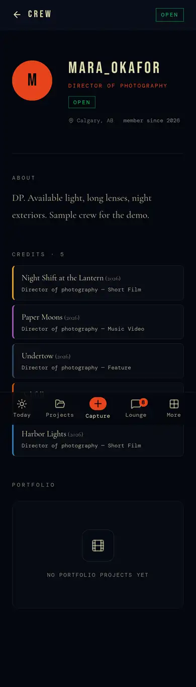 |
| `/jobs` | 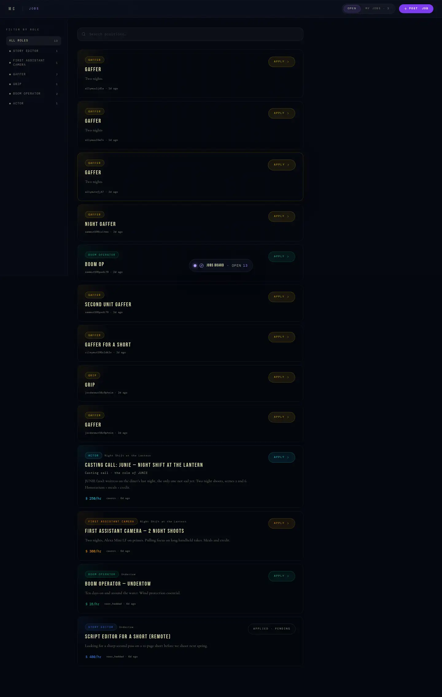 | 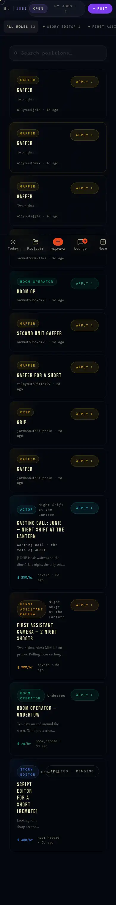 |
| `/jobs/[id]` | 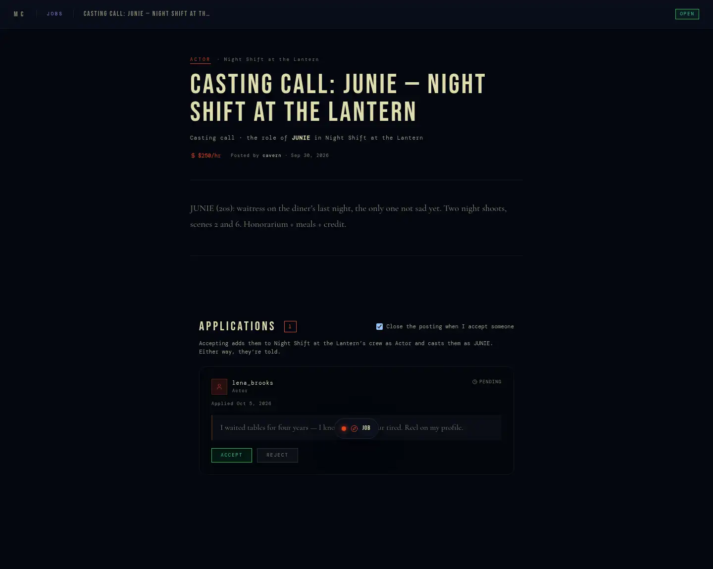 | 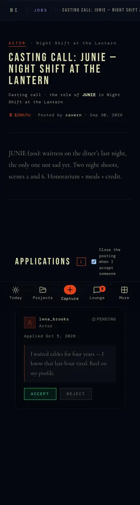 |
| `/portfolio` | 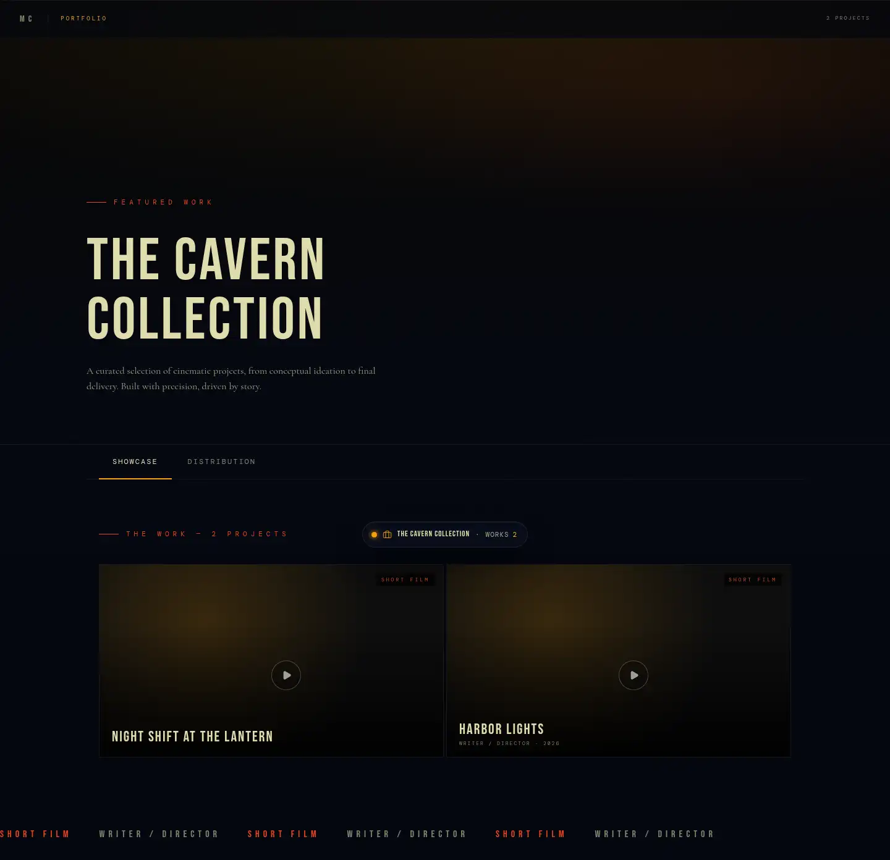 | 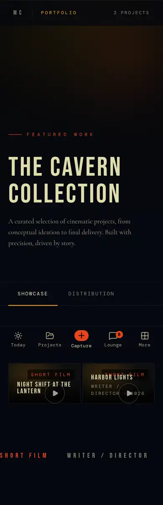 |
| `/portfolio/manage` | 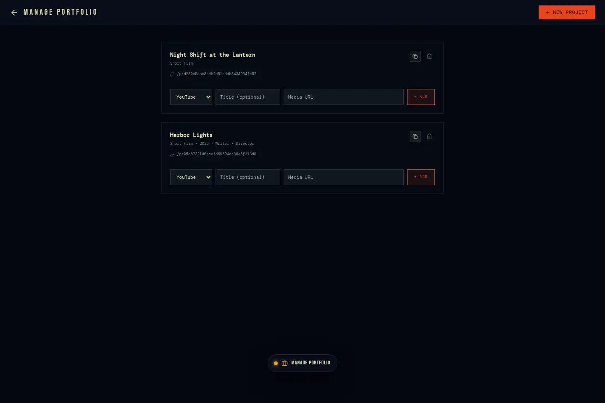 | 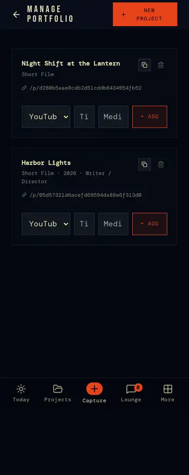 |
| `/showcase` (public) | 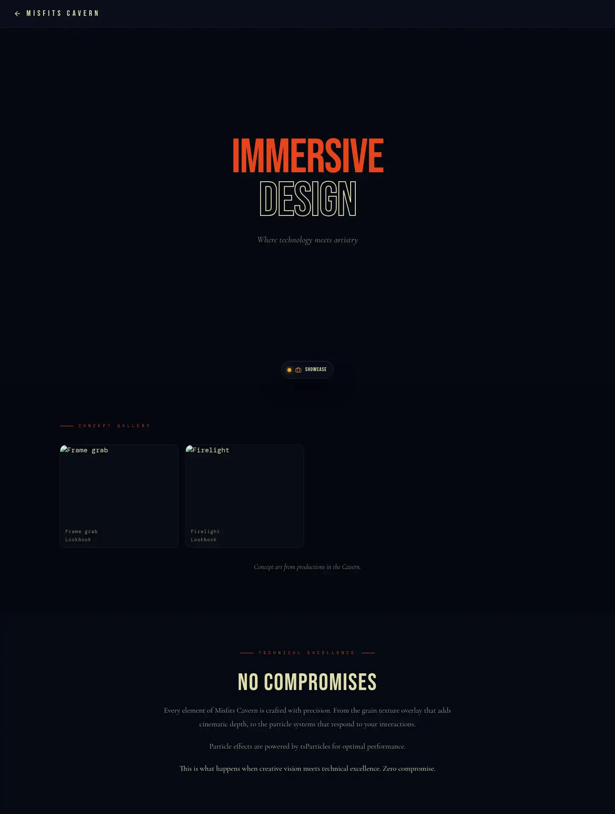 | 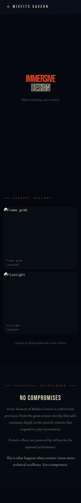 |

## Pages

### `/crew` — crew directory
Everyone who isn't sample data (`is_sample = false`): search by name, filter
by craft (`crafts`, `CraftPicker`), availability, "online now" (presence).
Cards open `/crew/[id]`. Empty / no-match states.

### `/crew/[id]` — a person
Profile (public columns only), craft, bio, location, links, **credits**
(`get_person_credits`: projects they created, crew rows with craft,
castings with the part — public projects for outsiders, the team's others for
teammates), portfolio pieces, message (→ Lounge DM), invite to a project.

### `/jobs` — jobs board
Open roles across the network: craft, project, pay, location, dates, brief.
Filter by craft; **Post a role** (the form opens pre-written when arriving
from casting or a project's brief — `rolePost`). A **casting call**
(`jobs.character_name`) says "accepting someone casts them in the role".
**Apply** from the card with an optional cover note. States: loading · error
("Couldn't load job listings") · none posted · none open · no match.

### `/jobs/[id]` — a role
The role, the project, the poster. For applicants: apply / applied. For the
poster: applicants with their profiles and notes; **respond**
(`respond_to_application`: accept → adds them to `project_crew` with the
job's craft, casts them for a casting call, optionally closes the job,
notifies them; decline).

### `/portfolio` — your work, presented
A cinematic page of the person's pieces (featured work, the work, a project
bible per piece, festival circuit, campaigns): embeds for YouTube / Vimeo /
Drive, images, links.

### `/portfolio/manage`
Add / edit / remove pieces (title, format, year, role, description, media
links), copy each piece's share link (`/p/<token>`). Projects finished in
the suite are added from their Delivery phase (milestone "Add it to your
portfolio").

### `/showcase` — public
The network's public face: published images and video from `public`,
non-sample projects (`get_public_showcase`, 24), signed out.

## Rules

- Sample (demo) people and projects never show on public surfaces or in the
  directory; jobs on sample projects are listed only to that production
  (`internal.job_listed`).
- Job posts linked to a project need `can_shape_project`; only the poster
  responds to applications; hiring never changes an existing member's role.
- Applicants can read jobs they applied to (`internal.applied_to`).
- One SELECT policy on `jobs` ("Jobs readable": the poster, listed open
  postings, an applicant's own) — `20261007010000_jobs_one_select_policy`.

## Connections

Brief → role posts. Casting board → casting calls. Accept → project crew →
call sheets, Lounge audiences, credits. Project delivery → portfolio → press
kit (`/p`) → showcase.

## Known gaps

- `/portfolio` uses a few hard-coded colours (`#0e0e0e`) where tokens belong.
- No reviews, references or verified credits yet (product call).
- Crew, jobs, portfolio and profile pages query tables directly rather than
  through `lib/` (BACKLOG 3.2).
