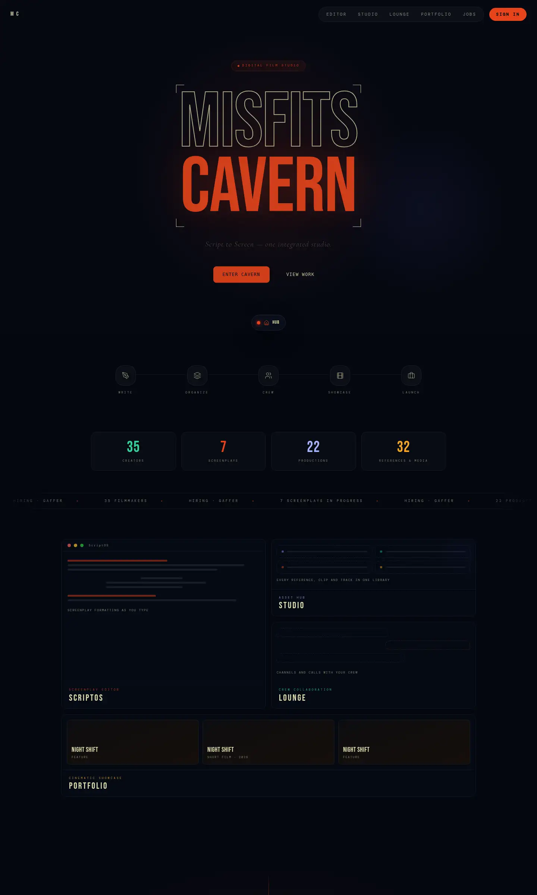
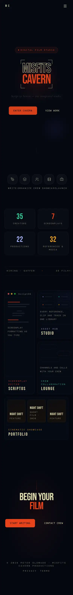
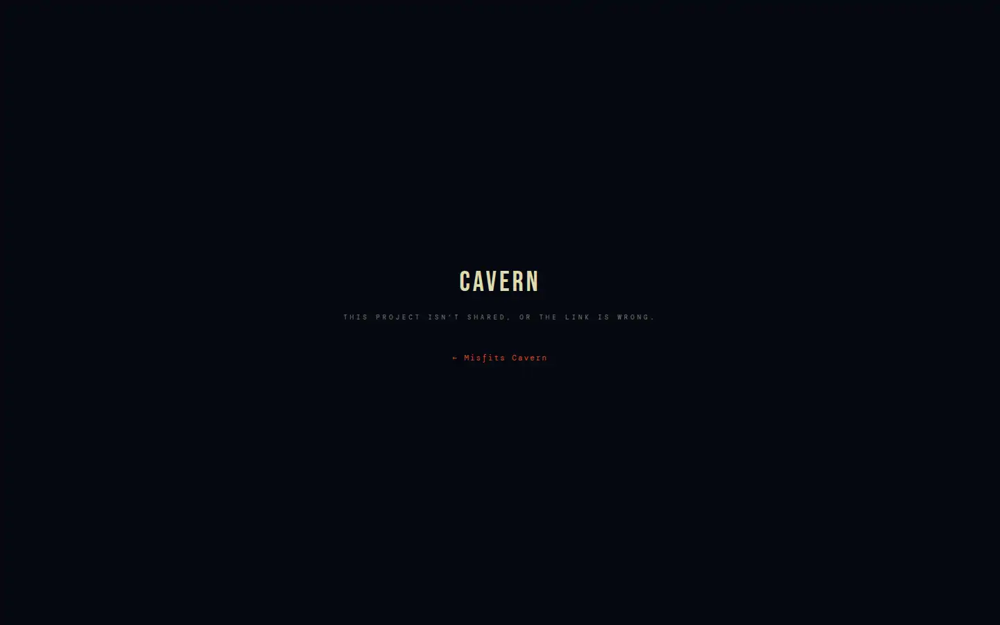
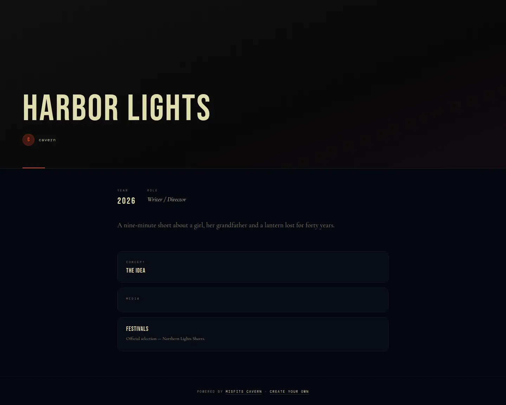
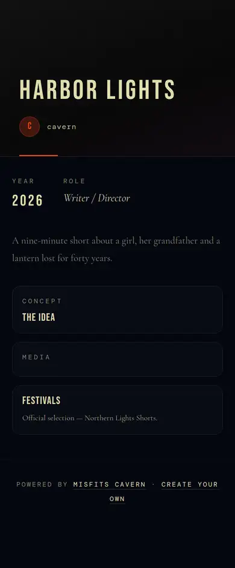
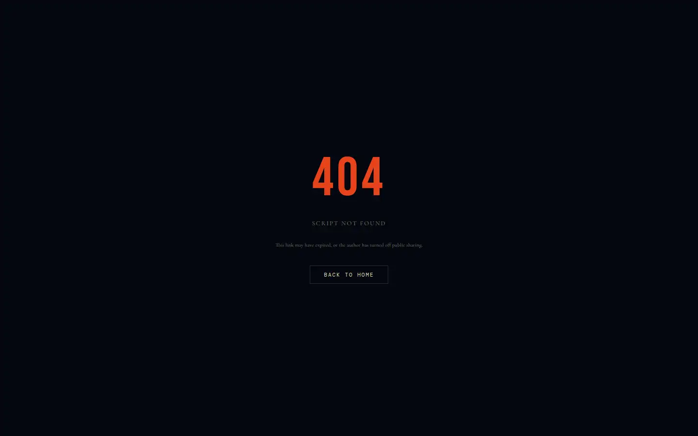
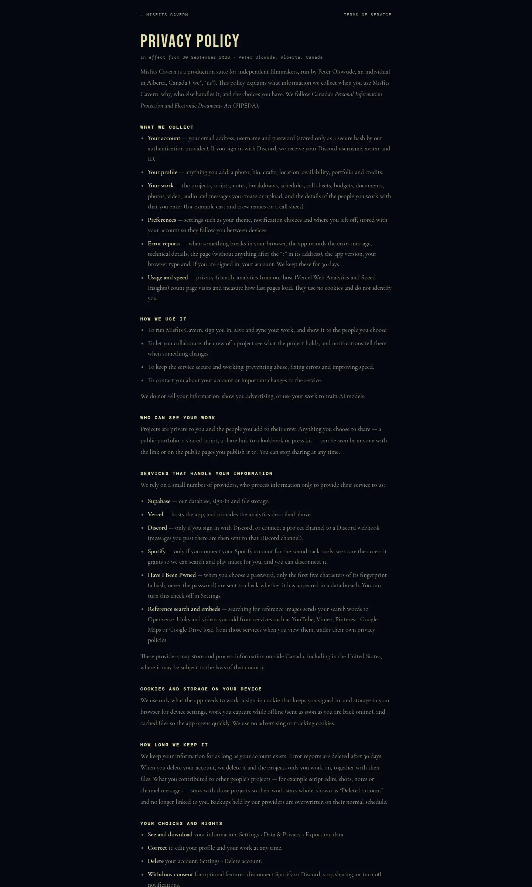
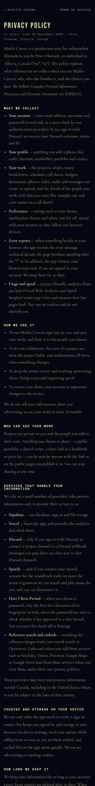
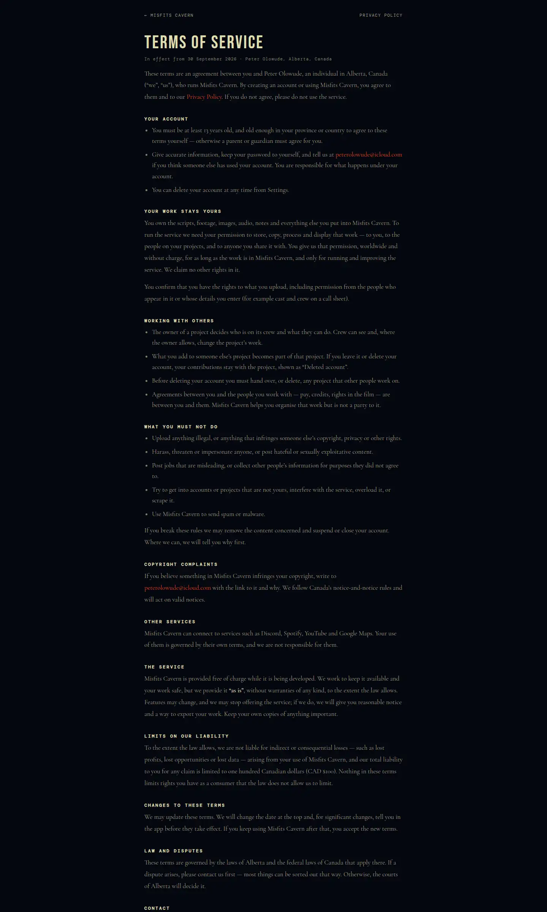
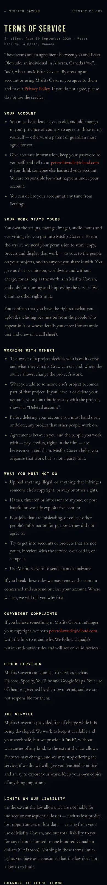

# 8 · Public pages and sharing

What a signed-out visitor (Riley, logged out) can see: the front door, the
legal pages, and the links people choose to share. Every public surface reads
through a narrow gate — an exact token checked by a definer function, or a
policy on an explicit "published" flag. Security model:
[`database-and-security.md`](../database-and-security.md) §2.C–D.

## Screens

| | Desktop | Phone |
|---|---|---|
| `/` landing |  |  |
| `/shared/[token]` project lookbook |  |  |
| `/p/[token]` press kit |  |  |
| `/s/[token]` shared script |  |  |
| `/privacy` |  |  |
| `/terms` |  |  |

`/showcase` is in §7.

## Pages

| Route | Rendered | What it shows | Gate |
|---|---|---|---|
| `/` | client | the hero (a "The Cavern" tag, the R13 mark in 3D — the moon lights the mountains and they turn with the pointer or a drag — then "by Misfits Cavern"), "Script to Screen — one integrated studio", pipeline, live platform totals and ticker, module tiles with real recent work, footer (The Cavern · by Misfits Cavern · © Peter Olowude, Privacy, Terms) | `get_platform_stats`, `get_recent_work` (samples excluded) |
| `/shared/[token]` | **server**, `force-dynamic`, Open Graph metadata | a project's lookbook: title, logline, creator, published items under their scenes, cast & crew and laurels (press kit) — never notes or unpublished items | `get_shared_project`, `get_shared_lookbook`, `get_press_kit`: exact token + visibility link/public |
| `/m/[id]` | route handler | a published file: 302 to a fresh signed URL (5 min images, 1 h video/audio), `no-store` | `get_published_media` + storage "shared read" policy |
| `/p/[token]` | server metadata (link preview) + client view | a portfolio piece as a press kit: media, blocks from the pitch board, credits | `portfolio_projects` / `portfolio_blocks` / `portfolio_media` are readable by everyone (all portfolio work is public by design) |
| `/s/[token]` | server | a screenplay, read-only, formatted, with its author; link previews (title, writer); never indexed | `get_shared_script(token)` — the exact token while sharing is on; nobody can list shared scripts or read one by id |
| `/privacy`, `/terms` | static | the policies; operator, province, contact and effective date from `lib/legal/legal.ts` | — |

Framing: every page sends `frame-ancestors 'self'` except the share pages
and `/m`, which anyone may embed.

## States

Each share page: loading · found · **not found** (wrong token, sharing turned
off, or the project back to Team/Private — the same answer for all, so a
token can't be probed) · empty (nothing published yet).

## Rules

- Turning sharing off takes effect at once: nothing is cached (`/m` is
  `no-store`, `/shared` is dynamic).
- The owner decides what's published (`media.shared`, `media_guard`).
- Sample data never appears on the landing page or the showcase.

## Known gaps

- The API routes are covered only by integration tests.
  (`/s` has `e2e/script-share.spec.ts`: on, read signed out, new link, off.)
