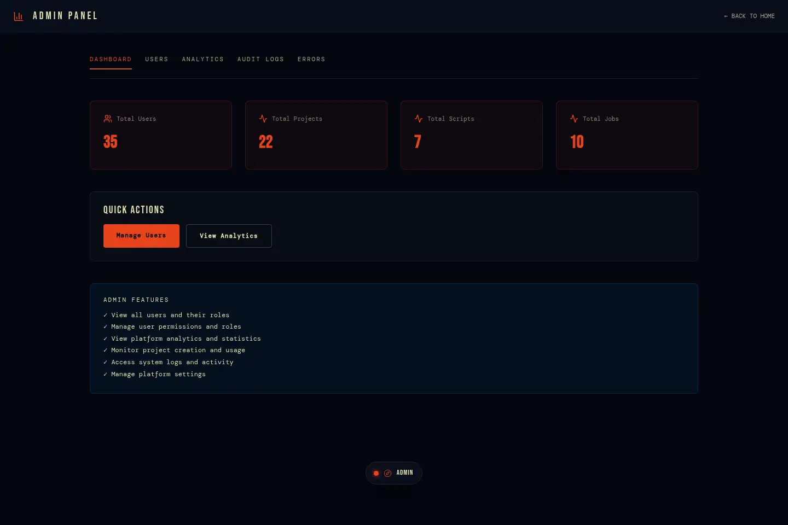
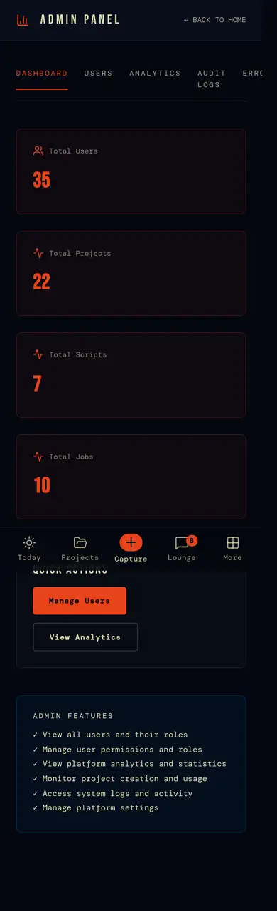
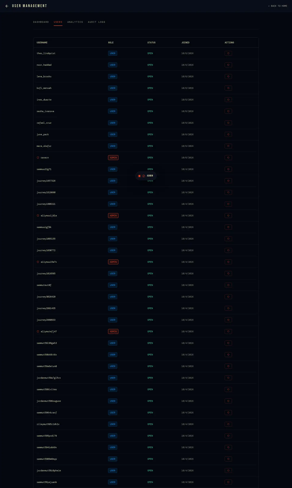
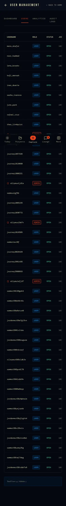
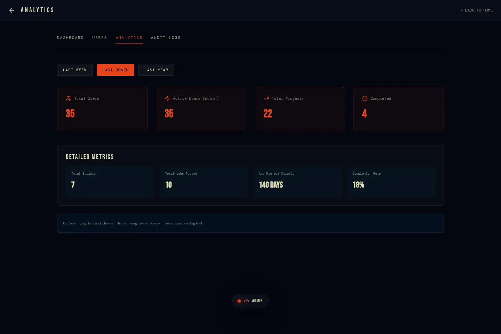
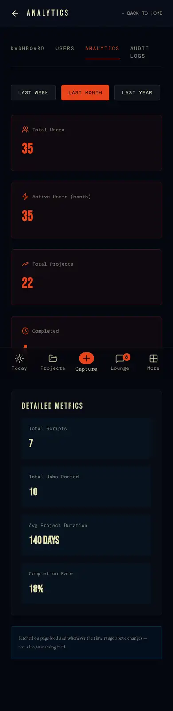
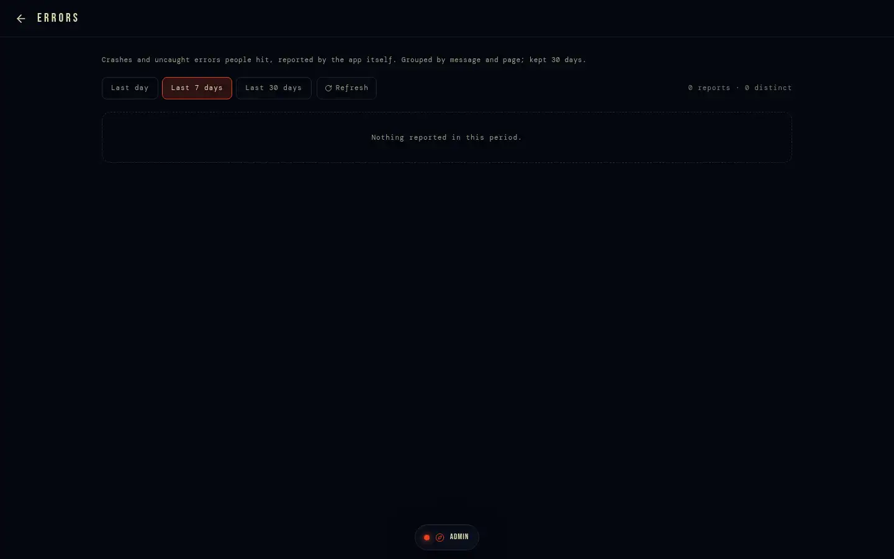
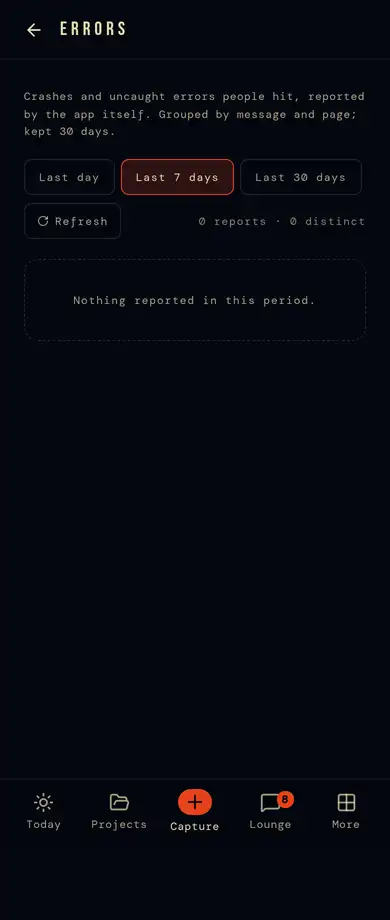
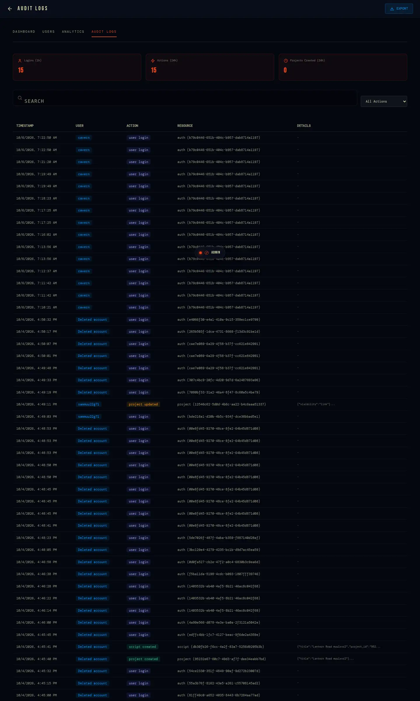
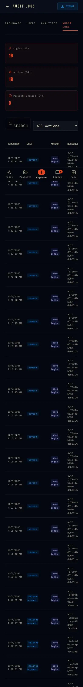

# 9 · Admin

`/admin/*` — running the platform. Gated twice: `proxy.ts` checks a real
session and `profiles.is_admin` on the server (non-admins go to `/`), and
every admin read goes through a function or policy that checks
`internal.caller_is_admin()`.

## Screens

| | Desktop | Phone |
|---|---|---|
| `/admin` |  |  |
| `/admin/users` |  |  |
| `/admin/analytics` |  |  |
| `/admin/errors` |  |  |
| `/admin/audit-logs` |  |  |

## Pages

| Page | What | Data |
|---|---|---|
| `/admin` | totals (users, projects, scripts, jobs) and links to the rest | `get_platform_stats` |
| `/admin/users` | every account: username, email, joined, admin; grant or remove admin (never your own; never the last admin) | `admin_list_users`, `set_user_admin` |
| `/admin/analytics` | users, projects, completed, scripts, jobs, average project duration, completion rate, sign-ups over a period | `admin_platform_analytics(since)` |
| `/admin/errors` | what broke for people, grouped by message and page, newest first, with counts; clear a group once it's fixed (confirm) | `client_errors` (30 days) |
| `/admin/audit-logs` | actions by person and time, search, filter by action; logins (1 h), actions (24 h), projects created (24 h) | `audit_logs` |

## Rules

- Admin rights change only through `set_user_admin()` (`profiles_guard`
  refuses anything else).
- Admins run community Lounge channels and edit the catalogues — crafts,
  project formats, brief questions, channel presets — which are admin-write
  tables.

## Known gaps

- The catalogues have no admin screens: they're changed by migration. A
  `/admin/catalogue` would let the owner add a craft, a format or a brief
  question without a deploy (3.14).
- No moderation tools (report a message, a job or a profile; hide or ban).
  Needed before the network opens to strangers (3.14).
- No usage view (storage, egress, Realtime) — the Supabase dashboard is the
  only place (and its grace-period banner is open: STATE).
